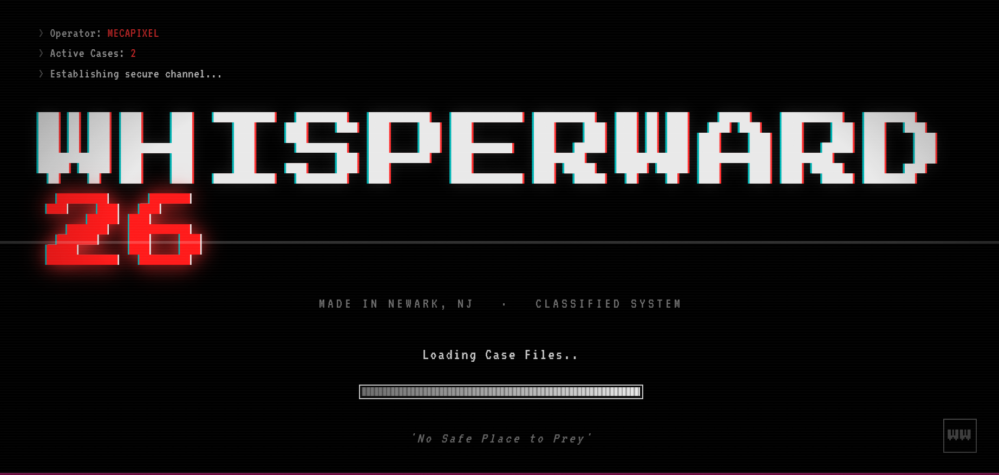
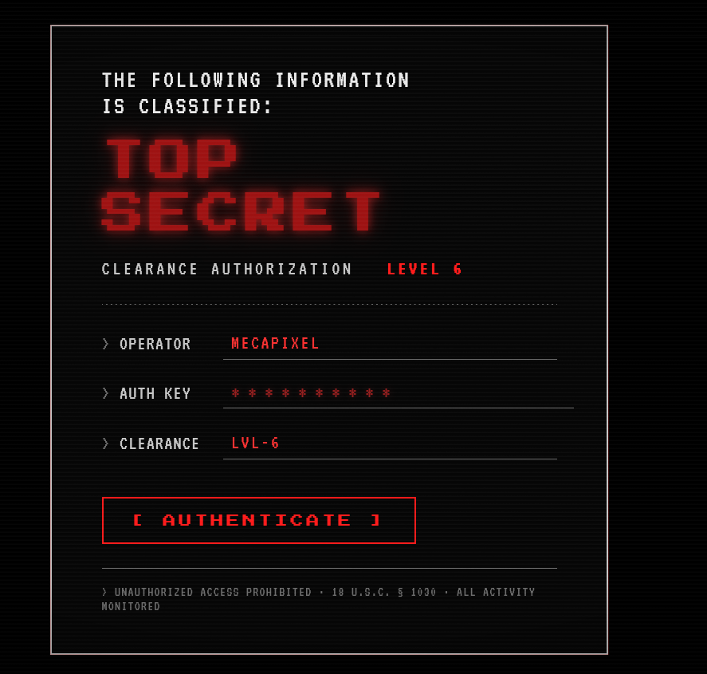
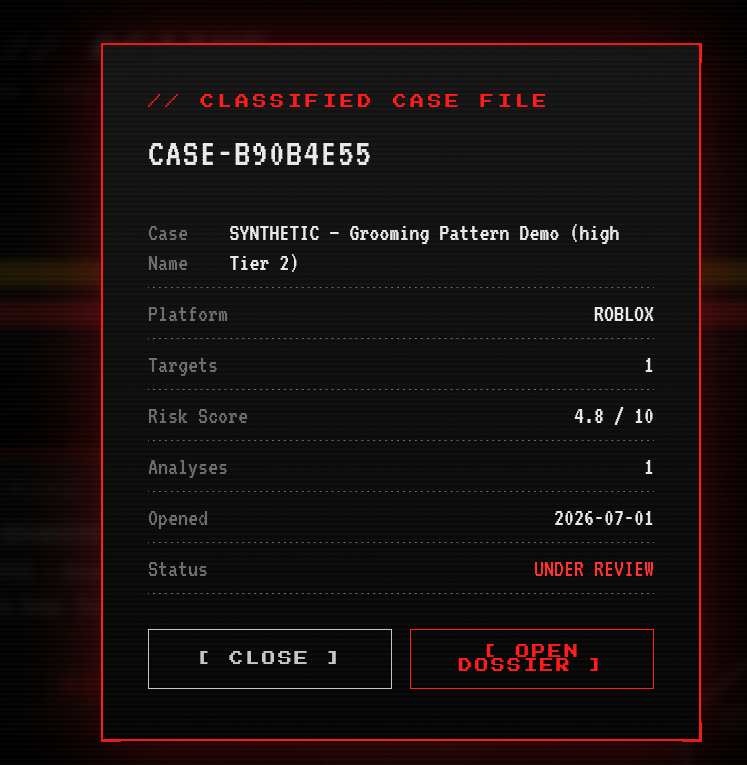
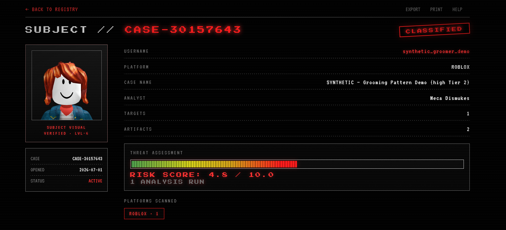
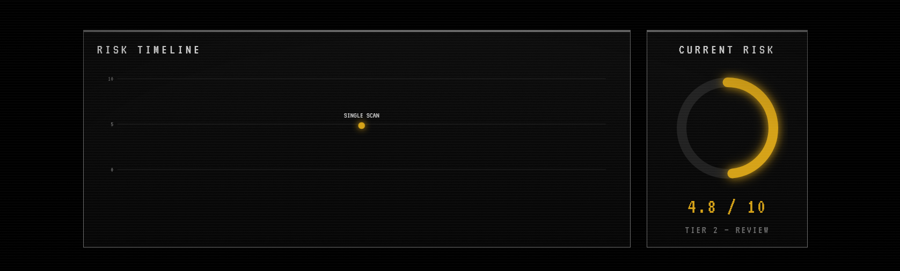
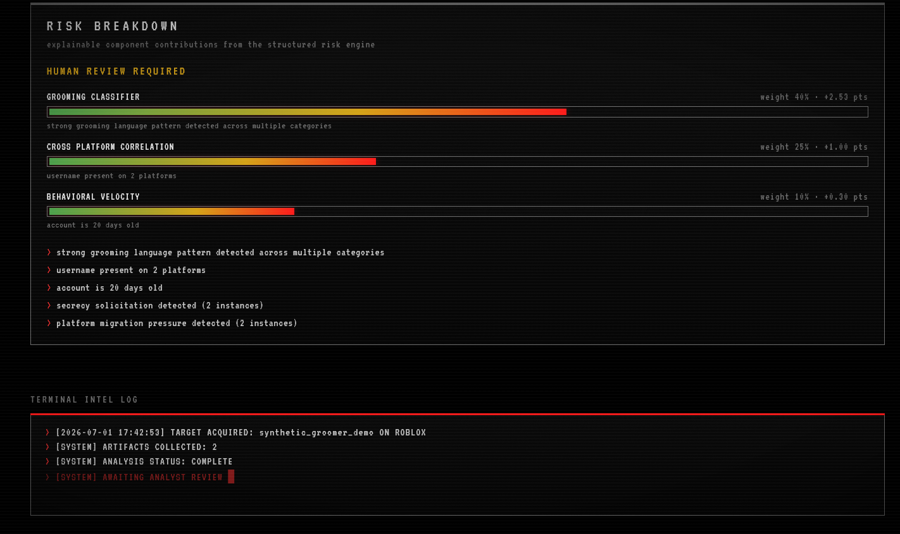

# WhisperWard OSINT

**An explainable digital investigations platform for Trust & Safety and child-protection investigations.**


[](LICENSE)

WhisperWard combines public-data collection, behavioral analysis, cross-platform identity correlation, and transparent, explainable risk scoring — while preserving human decision-making at every escalation. It is modular and local-first: it processes only publicly accessible data, runs AI analysis entirely on the local machine, and requires human review before any escalation.

Built by **Meca Dismukes (Pixora Inc.)** as both an active investigative tool and a portfolio project for ICAC-aligned and Trust & Safety work.

**Live demo:** [whisperward-osint.onrender.com](https://whisperward-osint.onrender.com) — seeded with clearly labeled synthetic cases. Hosted on a free tier, so the first visit after idle takes about thirty to sixty seconds to spin up.

---

## Why WhisperWard Exists

WhisperWard was built in direct response to a real incident involving an adult attempting to target a minor family member through Discord. It exists to give investigators and platform safety teams a faster, defensible, ethically bounded way to triage public-signal reports before they reach a human reviewer — not to replace that human judgment.

---

## For Recruiters and Hiring Managers

This project demonstrates production-grade skills directly transferable to ICAC-aligned investigations, Trust & Safety, and detection-engineering roles.

- Built a complete end-to-end investigative pipeline from raw public data to triaged, human-reviewable, court-defensible intelligence
- **Defensive and forensic depth:** tamper-evident hash-chained chain of custody, cryptographically signed PDF case reports, PII redaction that never touches the sealed original, a 90-day retention enforcer, and a strict human-in-the-loop mandate on every escalation
- **Production engineering:** 552 passing tests, structured logging, token-bucket rate limiting with circuit breakers, and SHA-256 evidence integrity throughout
- **Standards-aware intelligence:** STIX 2.1 export with confidence and rationale on every relationship, an honest MITRE ATT&CK mapping that grades each technique direct or analogue and states what falls outside ATT&CK's scope, and a documented platform threat model ([`THREAT_MODEL.md`](THREAT_MODEL.md))
- **Identity resolution done defensibly:** analyst-gated entity resolution where every graph edge carries its full justification, contradictions exclude accounts with the reason recorded, and promotion to a resolved identity requires a named analyst and lands in the tamper-evident custody chain
- **Responsible AI:** local-only analysis with explainable, decomposable risk scoring — no investigative data ever leaves the machine
- **Full-stack delivery:** Python backend, a JSON API layer, and a D3-driven web dashboard with live data
- **Governance first:** documented ethical boundaries, bias and fairness testing, and a calibrated tiered review workflow — see [`POLICY_BOUNDARY.md`](POLICY_BOUNDARY.md) and [`ethical_governance.md`](ethical_governance.md)

This work is transferable to offensive (OSINT tooling), purple-team (detection engineering and evasion-resistance), and defensive security roles.

---

## Ethical Boundaries

Full policy: see [`POLICY_BOUNDARY.md`](POLICY_BOUNDARY.md) and [`ethical_governance.md`](ethical_governance.md).

- Public data only — no private message interception, no device monitoring, no unauthorized access
- Local AI — investigative data is never sent to any third-party API
- Human review required for all Tier 2 and Tier 3 escalations
- Only investigator-created test accounts and synthetic data are used for development and demonstration — no real minors and no real suspects are processed for portfolio purposes
- No autonomous CyberTipline filing — the system produces a CyberTipline-aligned representative export only; a qualified, credentialed human confirms and files every escalation
- CSAM hash detection (PhotoDNA / NCMEC) is approval-gated and disabled by default pending external authorization

---

## Quick Start

See the dashboard with the bundled demo data in two commands:

```bash
pip install -r requirements.txt
python webapp/main.py
# then open http://localhost:8003
```

The dashboard runs with no AI dependencies and seeds synthetic demo cases automatically when the database is empty. The full collection and analysis pipeline (live OSINT, local AI) requires the Ollama runtime and the additional setup in [Installation](#installation) below.

The dashboard asks for an operator name at sign-in. This is deliberately lightweight: whoever runs the tool becomes the operator, the signed session cookie exists to prevent tampering rather than to gatekeep credentials, and the authoritative operator record lives in the tamper-evident chain-of-custody log. To keep sessions valid across host restarts, optionally set `WHISPERWARD_SESSION_SECRET` in the environment; otherwise a secret is generated and persisted locally on first run.

---

## Screenshots

<p align="center">
  <strong>Boot sequence</strong> — live case count pulled from the database<br>
  
</p>

<p align="center">
  <strong>Operator authentication</strong><br>
  
</p>

<p align="center">
  <strong>Case registry</strong> — active cases sorted by risk score, with the D3 threat-tier distribution across all active cases<br>
  
</p>

<p align="center">
  <strong>Classified case file</strong> — quick-view popup<br>
  
</p>

<p align="center">
  <strong>Subject dossier</strong> — risk assessment, artifacts, and live Roblox avatar<br>
  
</p>

<p align="center">
  <strong>Risk timeline and radial gauge</strong> — per-case scoring history and current-risk gauge<br>
  
</p>

<p align="center">
  <strong>Risk breakdown</strong> — explainable component contributions from the structured risk engine, with the terminal intel log<br>
  
</p>

<p align="center"><em>Screenshots use a clean test environment with only investigator-created accounts and synthetic data.</em></p>

## Key Features

### Completed

**Collection and analysis**
- Full command-line interface built with Typer and Rich
- Modular OSINT architecture via a shared `BaseOSINTModule` base class — new platforms add in under 100 lines
- Platform plugin architecture (`platform_plugin.py`) providing a clean fetch / normalize / risk-signal contract, with a live Roblox plugin wrapping the collector and a defined Discord contract for future work
- Live Roblox public API integration with retry logic and avatar collection
- Cross-platform username correlation via Sherlock across 8 platforms
- Local AI analysis using Ollama (qwen2.5-coder:7b) with a ChromaDB retrieval-augmented knowledge base
- Explainable, weighted risk-scoring engine that surfaces the top contributing signals
- Grooming-pattern behavioral classifier (isolation, secrecy, age probing, platform-migration pressure, gift incentives, and more) with negation handling and sequence awareness

**Evidence and chain of custody**
- Hash-chained, tamper-evident chain-of-custody log that detects edits and deletions
- Evidence packaging with SHA-256 hashing and a self-sealing manifest
- Cryptographically signed PDF case reports (pyHanko) with full integrity sections and tamper detection
- PII redaction engine producing a separate derived export that never modifies the sealed original
- CyberTipline-aligned representative referral export, redacted by default
- 90-day retention enforcer with dry-run-by-default purge that always preserves the audit chain

**Web interface**
- FastAPI web dashboard with live case data and a cohesive CRT-surveillance aesthetic
- JSON API layer (metrics, risk distribution, per-case summary, risk timeline, platform capabilities) serving real data
- D3.js visualizations: dashboard threat-distribution chart, per-case risk timeline, and current-risk radial gauge
- Live Roblox avatar rendering in the subject dossier

**Engineering**
- 552 passing pytest tests, structured logging, rate limiting with circuit breakers, and SHA-256 evidence integrity throughout

**Correlation and enrichment**
- Cross-platform correlation engine fusing five rarity-weighted signals — username (RapidFuzz), stylometry, activity timing, shared network, and perceptual avatar hashing — with NetworkX identity clustering, contradiction checking, and per-signal rationale with a first-class CLI `correlate` command that seals its full result into the evidence store
- IP enrichment and anonymization (Tor / VPN / hosting) detection, fully offline by design — no investigated address is ever transmitted to a third party
- Roblox investigation enrichment built on the plugin architecture, feeding review-only leads to the risk engine
- Discord public OSINT module (invite and widget intelligence, tokenless and public-data-only) implementing the same plugin contract
- CSAM hash detection module — architecture complete and tested, approval-gated and disabled by default pending external authorization (hash and metadata only, never image content)

**Entity resolution and identity graph**
- Unified entity model where the resolver proposes candidate identities from correlation output with full per-membership justification; a contradiction on any supporting edge excludes an account with the reason recorded
- Analyst-gated promotion: converting a candidate to a resolved entity requires a named analyst and is sealed into the tamper-evident chain of custody — unattributed resolution refuses to run
- Identity graph with accounts as nodes and every edge carrying its complete justification (strength, signals, rationale, contradiction notes), evidence-bearing path queries, and deterministic byte-stable serialization with a D3-shaped export
- Strictly reconstructive investigation timeline: every event names its source table and row, and no event is ever inferred
- Graph-aware risk scoring that reasons over graph-corroborated platforms when graph inputs are present; contradictions cap confidence and never alter a score

**Standards-aware intelligence**
- STIX 2.1 export: user-account observables, correlation relationships with confidence and rationale, analyst-resolved entities, and a suspicious-activity grouping — never emits adversary-assertion object types; byte-stable output sealed into the evidence store
- Honest MITRE ATT&CK mapping that maps only fired technical signals, grades each mapping direct or analogue, and states explicitly which findings fall outside ATT&CK's scope and where they are documented instead
- Behavioral-indicator taxonomy documented at pattern level ([`docs/BEHAVIORAL_INDICATORS.md`](docs/BEHAVIORAL_INDICATORS.md)) with weights versioned to the shipped classifier
- Platform threat model ([`THREAT_MODEL.md`](THREAT_MODEL.md)) covering assets, adversaries, failure modes, mitigations, and residual risks

### In active development
- Additional platform modules via the plugin contract (public data only)

---

## Governance and Review Workflow

WhisperWard generates intelligence; a qualified human makes every determination. Risk scores map to a calibrated three-tier workflow, enforced in code and documented in [`ethical_governance.md`](ethical_governance.md):

- **Tier 1 (0.0 – 1.9)** — logged for monitoring, scheduled for re-scan, no notification
- **Tier 2 (2.0 – 6.9)** — human reviewer notified, must acknowledge within 24 hours, no escalation without explicit approval
- **Tier 3 (7.0 – 10.0)** — evidence package generated automatically, but never filed without credentialed human sign-off embedded in the package manifest

Bias and fairness audits run on each major release. Any demographic proxy group showing a false positive rate more than five points above baseline blocks the release until resolved.

---

## Architecture

WhisperWard separates a reusable investigation core from the specializations built on top of it. The core owns evidence integrity, chain of custody, correlation, explainable risk scoring, redaction, retention, and reporting. A specialization declares its collectors, classifiers, and behavioral indicators to the core through a registration seam (`core/registry.py`) against stable contracts (`core/contracts.py`); the core never imports a specialization. Child safety is the first specialization. AI analysis runs entirely locally, every step logs its actions for auditability, and evidence is sealed under a tamper-evident hash chain.

```
                      CLI / Dashboard
                            |
        +-------------------+-------------------+
        |            WhisperWard Core           |
        |  contracts · registry · plugin base   |
        |  correlation engine · risk engine     |
        |  evidence store (SQLite + SHA-256     |
        |  chain of custody) · redaction ·      |
        |  retention · signed reporting         |
        +-------------------+-------------------+
                            |
              modules/child_safety  (first specialization)
              collectors (Roblox live, Discord contract, Sherlock)
              grooming classifier · CSAM hash-and-refer
              local AI + RAG (Ollama + ChromaDB)
              NCMEC-aligned referral export
                            |
              Human Review + Signed Export
```

---

## Tech Stack

Python · Typer · Rich · FastAPI · D3.js · SQLite · ChromaDB · Ollama (qwen2.5-coder:7b) · NetworkX · stix2 · pyHanko · reportlab · pytest · Loguru · structlog

---

## Installation

```bash
git clone https://github.com/Mecapixel/whisperward-osint.git
cd whisperward-osint

pip install -r requirements.txt

# Optional: Sherlock for username correlation
git clone https://github.com/sherlock-project/sherlock.git

# Optional: local AI analysis (one-time model pull)
ollama pull qwen2.5-coder:7b

# Initialize the database
python whisperward.py init-db
```

---

## Usage

WhisperWard runs as a command-line pipeline. A typical investigation:

```bash
# Create a case
python whisperward.py new-case --name "Investigation-2026"

# Add a target to the case (use the CASE-XXXX id returned above)
python whisperward.py add-target --case CASE-XXXXXXXX --username someusername --platform roblox

# Collect public OSINT for the case
python whisperward.py scan --case CASE-XXXXXXXX

# Run AI + RAG behavioral analysis
python whisperward.py analyze --case CASE-XXXXXXXX --ai

# Correlate identities across all targets in the case
python whisperward.py correlate --case CASE-XXXXXXXX

# Propose candidate entities from correlation output, then review them
python whisperward.py propose-entities --case CASE-XXXXXXXX
python whisperward.py entities --case CASE-XXXXXXXX

# Promote a reviewed candidate to a resolved entity (requires a named analyst)
python whisperward.py promote-entity --case CASE-XXXXXXXX --candidate CANDIDATE-ID --analyst "Analyst Name"

# View the identity graph and the reconstructive investigation timeline
python whisperward.py identity-graph --case CASE-XXXXXXXX
python whisperward.py timeline --case CASE-XXXXXXXX

# Export the case as a STIX 2.1 bundle and map fired signals to MITRE ATT&CK
python whisperward.py stix --case CASE-XXXXXXXX
python whisperward.py attack-map --case CASE-XXXXXXXX

# Generate the identity relationship graph
python whisperward.py graph --case CASE-XXXXXXXX

# Package evidence with SHA-256 manifest
python whisperward.py export --case CASE-XXXXXXXX

# Generate a signed PDF case report
python whisperward.py report --case CASE-XXXXXXXX

# Or run the full pipeline end to end
python whisperward.py run --case CASE-XXXXXXXX
```

Launch the web dashboard:

```bash
python webapp/main.py
# then open http://localhost:8003
```

---

## License

GNU Affero General Public License v3.0 — see [`LICENSE`](LICENSE).

WhisperWard is licensed under AGPL-3.0 deliberately. As a child-safety tool, it must stay open and auditable: anyone who builds on it or runs it as a network service is required to keep their version open source, so its ethical guardrails cannot be quietly removed and repurposed. This tool is for authorized investigative and defensive use only. All use must comply with platform terms of service and applicable law.

---

Built and maintained by Meca Dismukes — Pixora Inc.