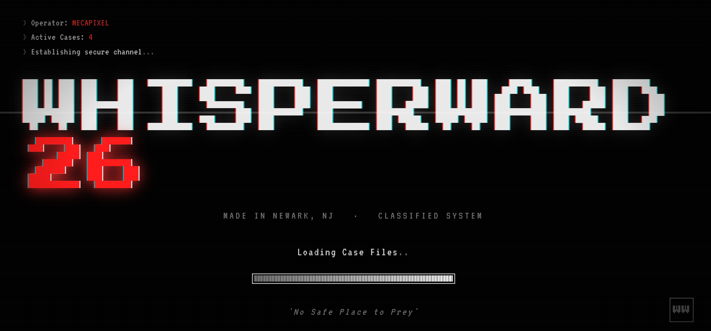
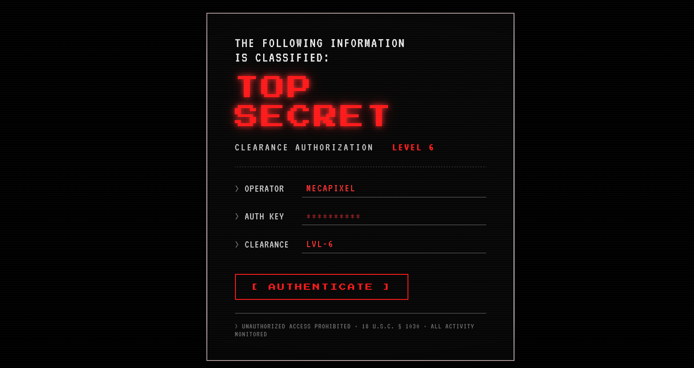
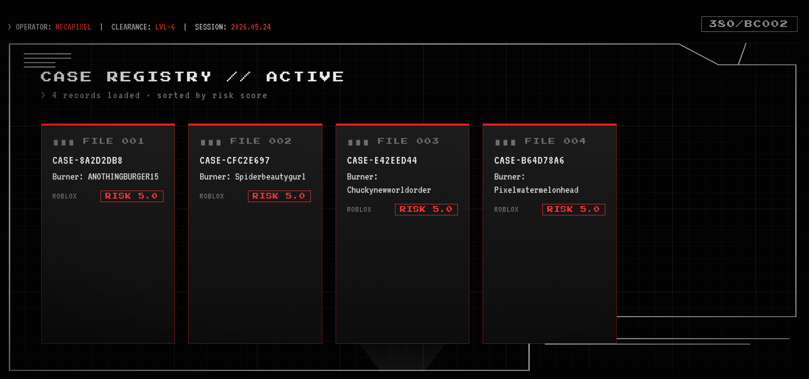
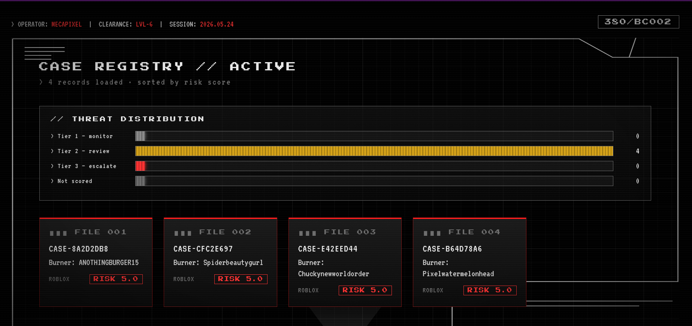
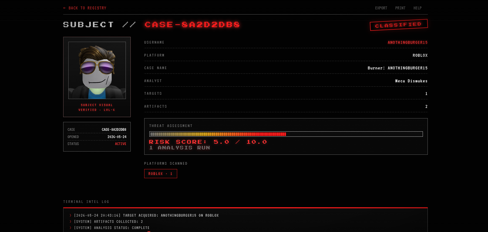
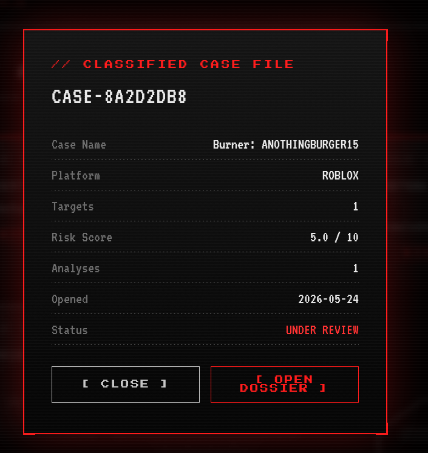

# WhisperWard OSINT

**AI-Powered Defensive OSINT Toolkit for Online Child Safety Investigations**


[](LICENSE)

A modular, local-first platform that helps authorized investigators triage public signals of predatory behavior targeting minors on platforms like Roblox and Discord. It processes only publicly accessible data, runs AI analysis entirely on the local machine, and requires human review before any escalation.

Built by **Meca Dismukes (Pixora Inc.)** as both an active investigative tool and a portfolio project for ICAC-aligned and Trust & Safety work.

---

## Why WhisperWard Exists

WhisperWard was built in direct response to a real incident involving an adult attempting to target a minor family member through Discord. It exists to give investigators and platform safety teams a faster, defensible, ethically bounded way to triage public-signal reports before they reach a human reviewer — not to replace that human judgment.

---

## For Recruiters and Hiring Managers

This project demonstrates production-grade skills directly transferable to ICAC-aligned investigations, Trust & Safety, and detection-engineering roles.

- Built a complete end-to-end investigative pipeline from raw public data to triaged, human-reviewable, court-defensible intelligence
- **Defensive and forensic depth:** tamper-evident hash-chained chain of custody, cryptographically signed PDF case reports, PII redaction that never touches the sealed original, a 90-day retention enforcer, and a strict human-in-the-loop mandate on every escalation
- **Production engineering:** 408 passing tests, structured logging, token-bucket rate limiting with circuit breakers, and SHA-256 evidence integrity throughout
- **Responsible AI:** local-only analysis with explainable, decomposable risk scoring — no investigative data ever leaves the machine
- **Full-stack delivery:** Python backend, a JSON API layer, and a D3-driven web dashboard with live data
- **Governance first:** documented ethical boundaries, bias and fairness testing, and a calibrated tiered review workflow — see [`POLICY_BOUNDARY.md`](POLICY_BOUNDARY.md) and [`ethical_governance.md`](ethical_governance.md)

This work is transferable to offensive (OSINT tooling), purple-team (detection engineering and evasion-resistance), and defensive security roles.

---

## Ethical Boundaries

Full policy: see [`POLICY_BOUNDARY.md`](POLICY_BOUNDARY.md) and [`ethical_governance.md`](ethical_governance.md).

- Public data only — no private message interception, no device monitoring, no unauthorized access
- Local AI — investigative data is never sent to any third-party API
- Human review required for all Tier 2 and Tier 3 escalations
- Only investigator-created test accounts and synthetic data are used for development and demonstration — no real minors and no real suspects are processed for portfolio purposes
- No autonomous CyberTipline filing — the system produces a CyberTipline-aligned representative export only; a qualified, credentialed human confirms and files every escalation
- CSAM hash detection (PhotoDNA / NCMEC) is approval-gated and disabled by default pending external authorization

---

## Quick Start

See the dashboard with the bundled demo data in two commands:

```bash
pip install -r requirements.txt
python webapp/main.py
# then open http://localhost:8003
```

The full collection and analysis pipeline (live OSINT, local AI) requires the additional setup in [Installation](#installation) below.

---

## Screenshots

**Boot sequence** — live case count pulled from the database


**Operator authentication**


**Case registry** — active cases sorted by risk score, with a live threat-distribution chart


**Threat distribution** — D3 risk-tier breakdown across all active cases


**Subject dossier** — risk assessment, risk timeline, radial gauge, artifacts, and intel log with live Roblox avatar


**Classified case file** — quick-view popup


*Screenshots use a clean test environment with only investigator-created accounts and synthetic data.*

---

## Key Features

### Completed

**Collection and analysis**
- Full command-line interface built with Typer and Rich
- Modular OSINT architecture via a shared `BaseOSINTModule` base class — new platforms add in under 100 lines
- Platform plugin architecture (`platform_plugin.py`) providing a clean fetch / normalize / risk-signal contract, with a live Roblox plugin wrapping the collector and a defined Discord contract for future work
- Live Roblox public API integration with retry logic and avatar collection
- Cross-platform username correlation via Sherlock across 8 platforms
- Local AI analysis using Ollama (qwen2.5-coder:7b) with a ChromaDB retrieval-augmented knowledge base
- Explainable, weighted risk-scoring engine that surfaces the top contributing signals
- Grooming-pattern behavioral classifier (isolation, secrecy, age probing, platform-migration pressure, gift incentives, and more) with negation handling and sequence awareness

**Evidence and chain of custody**
- Hash-chained, tamper-evident chain-of-custody log that detects edits and deletions
- Evidence packaging with SHA-256 hashing and a self-sealing manifest
- Cryptographically signed PDF case reports (pyHanko) with full integrity sections and tamper detection
- PII redaction engine producing a separate derived export that never modifies the sealed original
- CyberTipline-aligned representative referral export, redacted by default
- 90-day retention enforcer with dry-run-by-default purge that always preserves the audit chain

**Web interface**
- FastAPI web dashboard with live case data and a cohesive CRT-surveillance aesthetic
- JSON API layer (metrics, risk distribution, per-case summary, risk timeline, platform capabilities) serving real data
- D3.js visualizations: dashboard threat-distribution chart, per-case risk timeline, and current-risk radial gauge
- Live Roblox avatar rendering in the subject dossier

**Engineering**
- 408 passing pytest tests, structured logging, rate limiting with circuit breakers, and SHA-256 evidence integrity throughout

### In active development
- Cross-platform correlation engine fusing username, stylometry, timing, network, and avatar signals
- IP enrichment and anonymization (Tor / VPN) detection, offline by design
- CSAM hash detection module — architecture complete, approval-gated and disabled by default
- Roblox investigation module — deeper platform-specific investigation built on the plugin architecture

---

## Governance and Review Workflow

WhisperWard generates intelligence; a qualified human makes every determination. Risk scores map to a calibrated three-tier workflow, enforced in code and documented in [`ethical_governance.md`](ethical_governance.md):

- **Tier 1 (0.0 – 1.9)** — logged for monitoring, scheduled for re-scan, no notification
- **Tier 2 (2.0 – 6.9)** — human reviewer notified, must acknowledge within 24 hours, no escalation without explicit approval
- **Tier 3 (7.0 – 10.0)** — evidence package generated automatically, but never filed without credentialed human sign-off embedded in the package manifest

Bias and fairness audits run on each major release. Any demographic proxy group showing a false positive rate more than five points above baseline blocks the release until resolved.

---

## Architecture

WhisperWard is a modular pipeline. Each platform collector inherits from a shared base class and is exposed through a normalized plugin contract, feeds a central evidence store, and is scored by a weighted, explainable risk engine before reaching any human-facing output. AI analysis runs entirely locally. Every step logs its actions for auditability, and evidence is sealed under a tamper-evident hash chain.

```
CLI / Dashboard
      |
Platform Plugins  (Roblox live, Discord contract)
      |
OSINT Collectors  (Roblox, Sherlock)
      |
Evidence Store  (SQLite + SHA-256 chain of custody)
      |
Local AI + RAG  (Ollama + ChromaDB)
      |
Risk Engine  (weighted, explainable scoring)
      |
Human Review + Signed Export  (PDF report, NCMEC-aligned referral, redaction, retention)
```

---

## Tech Stack

Python · Typer · Rich · FastAPI · D3.js · SQLite · ChromaDB · Ollama (qwen2.5-coder:7b) · pyHanko · reportlab · pytest · Loguru · structlog

---

## Installation

```bash
git clone https://github.com/Mecapixel/whisperward-osint.git
cd whisperward-osint

pip install -r requirements.txt

# Optional: Sherlock for username correlation
git clone https://github.com/sherlock-project/sherlock.git

# Optional: local AI analysis (one-time model pull)
ollama pull qwen2.5-coder:7b

# Initialize the database
python whisperward.py init-db
```

---

## Usage

WhisperWard runs as a command-line pipeline. A typical investigation:

```bash
# Create a case
python whisperward.py new-case --name "Investigation-2026"

# Add a target to the case (use the CASE-XXXX id returned above)
python whisperward.py add-target --case CASE-XXXXXXXX --username someusername --platform roblox

# Collect public OSINT for the case
python whisperward.py scan --case CASE-XXXXXXXX

# Run AI + RAG behavioral analysis
python whisperward.py analyze --case CASE-XXXXXXXX --ai

# Generate the identity relationship graph
python whisperward.py graph --case CASE-XXXXXXXX

# Package evidence with SHA-256 manifest
python whisperward.py export --case CASE-XXXXXXXX

# Generate a signed PDF case report
python whisperward.py report --case CASE-XXXXXXXX

# Or run the full pipeline end to end
python whisperward.py run --case CASE-XXXXXXXX
```

Launch the web dashboard:

```bash
python webapp/main.py
# then open http://localhost:8003
```

---

## License

GNU Affero General Public License v3.0 — see [`LICENSE`](LICENSE).

WhisperWard is licensed under AGPL-3.0 deliberately. As a child-safety tool, it must stay open and auditable: anyone who builds on it or runs it as a network service is required to keep their version open source, so its ethical guardrails cannot be quietly removed and repurposed. This tool is for authorized investigative and defensive use only. All use must comply with platform terms of service and applicable law.

---

Built and maintained by Meca Dismukes — Pixora Inc.